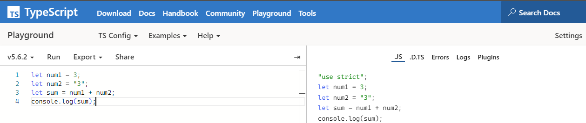
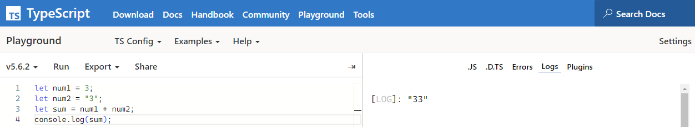
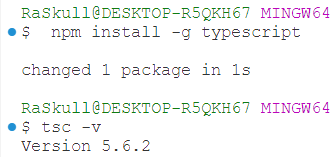

## TypeScript (TS)
**Superset of JavaScript:** TypeScript is a typed superset of JavaScript, meaning it adds features to JavaScript while remaining compatible with it.  
**Static Typing:** Variables have defined data types at compile time, which can help catch errors early.  
**Optional Typing:** You can choose to use static typing or not, making it flexible for existing JavaScript projects.  
**Compilation:** TypeScript code is compiled into JavaScript before execution.  

So at the end Typescript is just wrapper arround javascript & we can visualize that with  
https://www.typescriptlang.org/

__TS__ vs __JS__  

__TS__ after compilation  



## Installation  
Note: need Node installed

```bash
npm i -g typescript
```
OR
```bash
npm install -g typescript
```


Version Check
```bash
tsc -v
```
```bash
tsc --version
```



## Nodemon installation  
```bash
npm i -g install
npm install -g ts-node
``` 