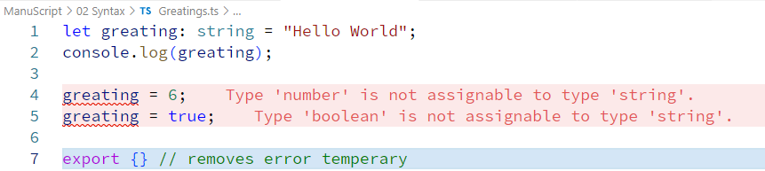

# Syntax
```typescript
let variableName: DataType = Value;
```

# JavaScript
```javascript
let greating = "Hello World";
console.log(greating);
```
# TypeScript
```typescript
let greating: string = "Hello World";
console.log(greating);

export {} // removes error temperary
```

Typecheck safety
```typescript
let greating: string = "Hello World";
console.log(greating);

greating = 6;
greating = true;

export {} // removes error temperary
```  

