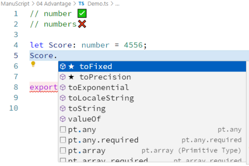
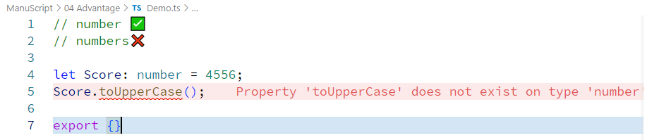
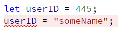

Because of Type safety of TypeScript is striaght forward lesser error, Quality code, better Refactoring.

> Only accessing specified data type methods  
  

similarly when we do other datatypes it shows us only supported methods & operations.
  

writting typescript with full annotation is not always recomended also
like this   
```typescript
let userID: numer = 456;
```
OR
```typescript
let userID: numer;
userID = 456;
```   
this is a too overuse of typescript in some cases

when we do
```typescript
let userID = 456;
```   
this is totally fine, but we might think this is tradional javascript after all but this thing is not same as javascript & we will learn about that later.  
  
becuase as we see here it is already giving us a error which is not vanilla javascript behavior.

so moral of story we dont need to follow stereotype TS syntax everywhere like this
```typescript
let variableName: DataType = Value;
```
but there is special occasion where we can use this for more safety.