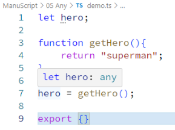
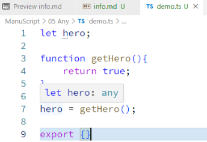
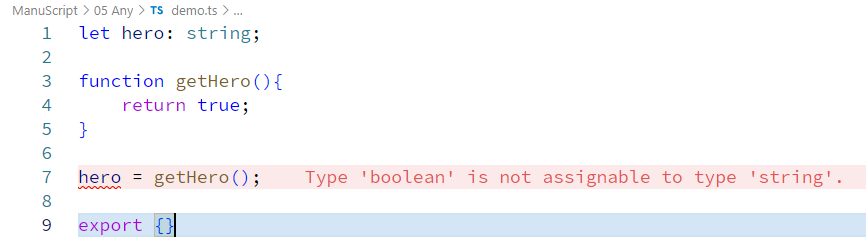

 spamming **any** is considered as not so good practice in TypeScript  


```typescript
 let hero;

function getHero(){
    return "superman";
}

hero = getHero();

export {}
```  
  
so this behavior show us the type **any**  
```typescript
 let hero;

function getHero(){
    return true;
}

hero = getHero();

export {}
```  
  
here in different data type return it is also getting **any**  

if we provide it the proper datatype in first place it will give us error but built robust code  
```typescript
let hero: string;

function getHero(){
    return true;
}

hero = getHero();

export {}
```
  


# the keyword **any** basically means in please turn of type-safety in TypeScript