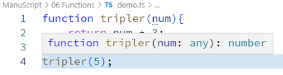
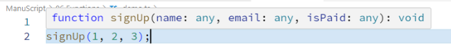

lets create a function which triples the number  
```typescript
function tripler(num){
    return num * 3;
}
tripler(5);
```  
this is fine code in TypeScript but not perfectly fine, there is problem here  
## problem 1: Parameter safety
  
again it shows us any as its type.  
```typescript
// function tripler(num){
//     return num * 3;
// }
tripler("5");
```  
OR
```typescript
// function tripler(num){
    num.toUpperCase();
//     return num * 3;
// }
// tripler(5);
```  
this will also work fine in the code **Which defeats purpose of TypeScript is first place**.  

## Solution 1
```typescript
function tripler(num: number){
    return num * 3;
}
tripler(5);
```  
now if we do any mischeif it will throw us error.

## Problem 2: Parameter numbers
```typescript
function signUp(name, email, isPaid){}
signUp(1, 2, 3);
```  
again the issue is any we can pass any arbitrary value as arguments.  
  

## solution 2:
```typescript
function signUp(name: string, email: string, isPaid: boolean){}
signUp("Ganesh", "G@gmail.com", false);
```  
we can pass default parameter as well
```typescript
function signUp(name: string, email: string, isPaid: boolean = false){}
signUp("Ganesh", "G@gmail.com");
```  