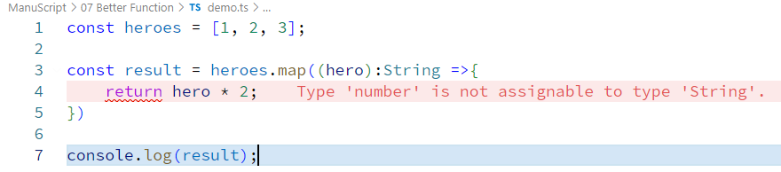

```typescript
const heroes = ["Batman", "Superman", "Wonder Woman"];

const result = heroes.map(hero =>{
    return `this is ${hero}'s term to fight`;
})

console.log(result);
```  
OR we can change values of array elements  
```typescript
const heroes = [1, 2, 3];

const result = heroes.map(hero =>{
    return hero * 2;
})

console.log(result);
```  

here we can see typescript can work same as javascript.

>use typescript typesafety  
```typescript
// const heroes = [1, 2, 3];

const result = heroes.map((hero):String =>{
//     return hero * 2;
// })

// console.log(result);
```  
and now it will show us error
  