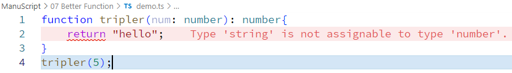

```typescript
function tripler(num: number){
    return "hello";
}
tripler(5);
```  
this code seems fine but yet another thing we can do here is make sure function return the same datatype as funcion's parameter  
```typescript
function tripler(num: number): number{
    return "hello";
}
tripler(5);
```  
  
```typescript
function tripler(num: number): number{
    return num * 3;
}
tripler(5);
```  
now its perfectly fine TypeScript snippet.

## Function with no return  
```typescript
function printError(errorMsg: string): void{
    console.log(errorMsg);
} // void to return nothing
```  
## Function to throw error & terminate function without return statement
```typescript
function handleError(errorMsg: string): never{
    throw new Error(errorMsg);
}
```  