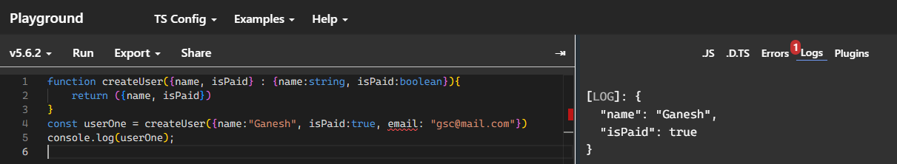
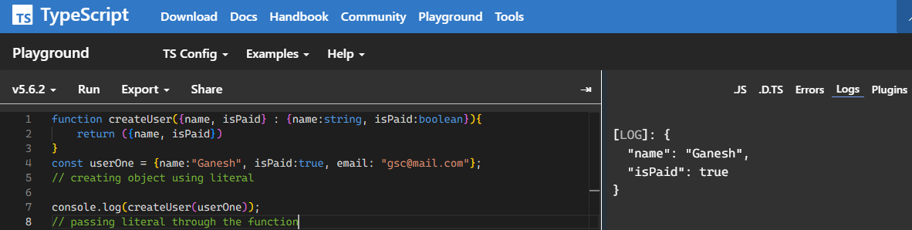

# passing an extra argument inside object creation function  
## Problem  
```typescript
function createUser({name, isPaid} : {name:string, isPaid:boolean}){
    return ({name, isPaid})
}
const userOne = createUser({name:"Ganesh", isPaid:true, email: "gsc@mail.com"})
console.log(userOne);
```  
although it will create an object but it will never include email & throw an error
  

## Solution  
```typescript
function createUser({name, isPaid} : {name:string, isPaid:boolean}){
    return ({name, isPaid})
}
const userOne = {name:"Ganesh", isPaid:true, email: "gsc@mail.com"};
// creating object using literal

console.log(createUser(userOne));
// passing literal through the function
```  
but even this it wont add extrs argument (email) to it.
  
no error but no mail added and we will discuss next