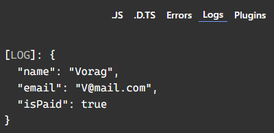

### Type Alias is something where you can define blueprint of datatypes for an object  

### borderline, Type Alias binds multiple type defination & make single defination for that which we can use it multiple times, which makes code short, concise & easy to maintain  

Syntax:
```typescript
type varName = {
    keyOneName: datatype;
    keyTwoName: datatype;
    key__nName: datatype;
}
```  
`type` is a type alias keyword is TypeScript

Example:
```typescript
type User = {
    name: string;
    email: string;
    isPaid: boolean;
}

function createUser({name, email, isPaid} : User){
    return {name, email, isPaid};
}

console.log(createUser({name:"Vorag", email:"V@mail.com", isPaid:true}));
```  
  


> ### type alias is made to shorten the type defination of funtion which creates object, without this imagine the function's type defination which have more than 10 datatypes & we are writting that individually.  