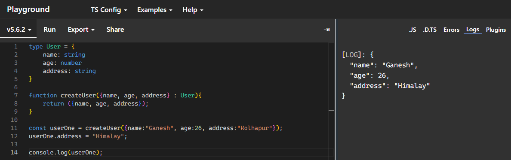
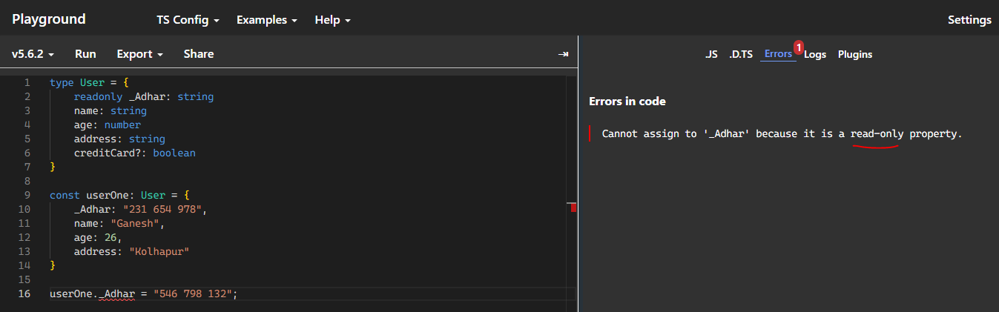
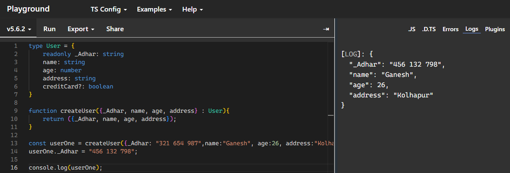

## problem : there are some scenarios where we have to deal with a object properties, a) mandatory + unchangable property, b) optional property.

```bash
    readonly     (keyword for ReadOnly)
    ?            (keyword for optional)
```  

Normal Example:  
```typescript
type User = {
    name: string
    age: number
    address: string
}

function createUser({name, age, address} : User){
    return ({name, age, address});
}

const userOne = createUser({name:"Ganesh", age:26, address:"Kolhapur"});
userOne.address = "Himalay";

console.log(userOne);
```  
  

Example with ReadOnly & Optional:  
```typescript
type User = {
    readonly _Adhar: string
    name: string
    age: number
    address: string
    creditCard?: boolean
}

const userOne: User = {
    _Adhar: "231 654 978",
    name: "Ganesh",
    age: 26,
    address: "Kolhapur"
    // can skip credit card cause its optional
}

userOne._Adhar = "546 798 132";
```  
  

### note: this princple will not apply on object instance  
```typescript
type User = {
    readonly _Adhar: string
    name: string
    age: number
    address: string
    creditCard?: boolean
}

function createUser({_Adhar, name, age, address} : User){
    return ({_Adhar, name, age, address});
}

const userOne = createUser({_Adhar: "321 654 987",name:"Ganesh", age:26, address:"Kolhapur"});
userOne._Adhar = "456 132 798";

console.log(userOne);
```  
  
