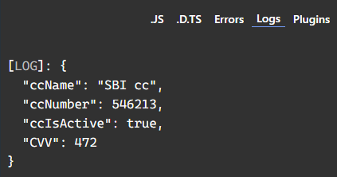

## as we TypeAlias can bind multiple datatype to create single datatype blueprint for object creation.  
But  
## a TypeAlias can bind multiple TypeAlias as well.  

```typescript
type creditName = {
    ccName: string
}

type creditNumber = {
    ccNumber: number;
}

type creditActive = {
    ccIsActive: boolean
}

type ccDetails = creditName & creditNumber & creditActive & { CVV: number}
// binded 3 alias with 1 new alias.

function creditCardCreate({ccName, ccNumber, ccIsActive, CVV}: ccDetails){
    return {ccName, ccNumber, ccIsActive, CVV};
}

console.log(creditCardCreate({ccName: "SBI cc", ccNumber:546213, ccIsActive: true, CVV: 472}));
```  
  