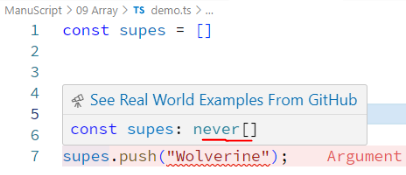

> if we use regular array is TS it will say its default datatype is **never**.  
```typescript
const supes = []
supes.push("Wolverine");
```  
  

here we can see the default array type is never so we cannot push value to it.

## Syntax:  
#### 1. short hand syntax
```typescript
const arrayName : dataType[] = [elements]
// short hand syntax
```  
Example:  
```typescript
const Xmen: string[] = ["Megnito", "Professor X", "Mystique"]

Xmen.push("Wolverine");
```

#### 2. generic syntax
```typescript
const arrayName : Array<dataType> = [elements]
// generic syntax
```  
```typescript
const powers: Array<number> = [1, 5, 3]
powers.push(32);
```  
#### 3. Type Alias
```typescript
type TypeName = {
    KeyOne = dataType
    KeyTwo = dataType
    ....
}
const arrayName : dataType[] = [elements]
// OR
const arrayName : Array<dataType> = [elements]
// Type Alias
```  
```typescript
type User = {
    name: string,
    age: number
}

const friends: User[] = [
    {name: "FriendOne", age: 26},
    {name: "FriendTwo", age: 27}
]

const family: Array<User> = [
    {name: "Mother", age: 44},
    {name: "Father", age: 52}

]
```  