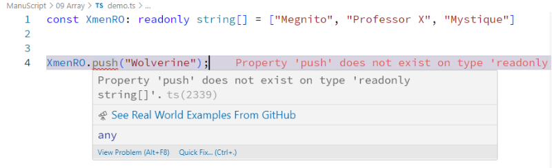
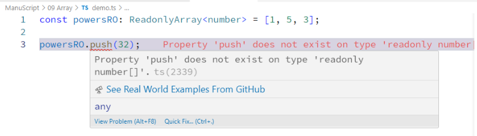

## Syntax:  
### Short Hand Syntax  
```typescript
const arrayName: readonly dataType[] = [elements];
```  
Example:  
```typescript
const XmenRO: readonly string[] = ["Megnito", "Professor X", "Mystique"];
// cannot modify an array
XmenRO.push("Wolverine");
```  
  

### Generic Syntax  
```typescript
const arrayName: ReadonlyArray<dataType> = [elements];
```  
Example:  
```typescript
const powersRO: ReadonlyArray<number> = [1, 5, 3];
// cannot modify an array
powersRO.push(32);
```  
  
