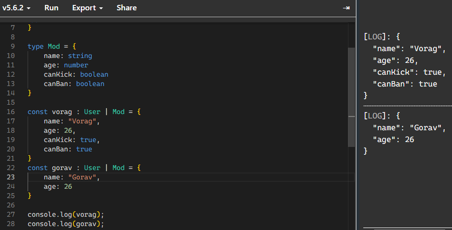

## type-alias + union
```typescript
// A discord can have multiple Roles in it.
type User = {
    name: string
    age: number
}

type Mod = {
    name: string
    age: number
    canKick: boolean
    canBan: boolean
}

const vorag : User | Mod = {
    name: "Vorag",
    age: 26,
    canKick: true,
    canBan: true
}
const gorav : User | Mod = {
    name: "Gorav",
    age: 26
}

console.log(vorag);
console.log(gorav);
```  
  