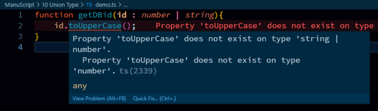
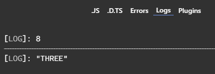

## Syntax:  
```typescript
function fnName(parameter : dataTypeOne | dataTypeTwo){
    // operation
}
```  
Example:  
```typescript
function getDBid(id : number | string){
    console.log(id);
    return id;
}

getDBid(3);
getDBid("3");
```  

> Problem : we cannot perform methods on either one of dataType  
```typescript
function getDBid(id : number | string){
    id.toUpperCase();
}
```  
  
but we can resolve that with simple conditional statements  
```typescript
function getDBid(id : number | string){
    if(typeof id == "string"){
        return id.toUpperCase();
    }else if(typeof id == "number"){
        return id + 5;
    }
    console.log(id);
    return id;
}

console.log(getDBid(3));
console.log(getDBid("three"));
```  
  
