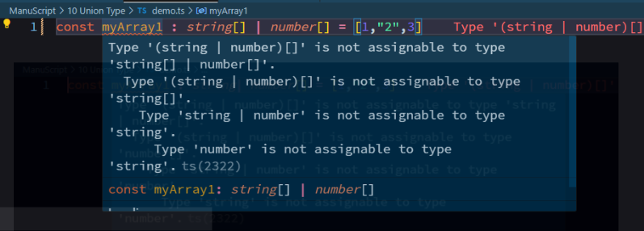

## OR union  
### Syntax:  
```typescript
const arrayName : string[] | number[] = [elements]
```  
Example:  
```typescript
// all elements must be String
const myArray1 : string[] | number[] = ["1","2","3"]
```  
```typescript
// all elements must be Number
const myArray1 : string[] | number[] = [1,2,3]
```  
but no combine elemements allowed  
```typescript
const myArray1 : string| number[] = [1,"2",3]
```  
  
## AND union  
### Syntax:  
```typescript
const arrayName : (string | number)[] = [elements]
```  
Example:
```typescript
// both / multiple dataTypes allowed
const myArray1 : (string | number)[] = [1,"2",3]
```  

