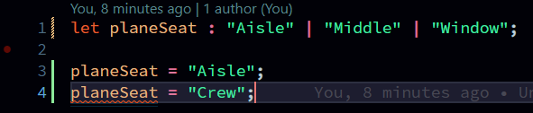

> Some use cases we need hardcoded union values  

## Syntax: 
```typescript
let variableName : "valOne" | valTwo | "valThree" | true
```  

Example:  
```typescript
let planeSeat : "Aisle" | "Middle" | "Window";

planeSeat = "Aisle";
planeSeat = "Crew"; // will throw error
```  
  