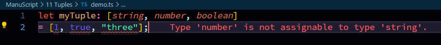

## Characteristics of Tuples  
**Immutable**: Once defined, you cannot change a tuple.  
**Ordered**: The items in a tuple maintain their order.  
**Heterogeneous**: A tuple can hold items of different data types (e.g., integers, strings, lists, etc.).  

## Tuple is just an array who strictly follows the dataType order withing it element.  
**Example**:  
Array  
```typescript
// A normal array donot follows the type-declaration like here order is (1.string, 2. number, 3.boolean) but elements can be a many without type-declaration order
let myArr: (string | number | boolean)[] = [1, true, "three"];
```  
Tuple  
```typescript
// ✔️
let myTuple: [string, number, boolean] = ["one", 2, false];
// here we maintained order, 1.string="one"✔️, 2.number=2✔️, 3.boolean=false✔️. if we don't it will throw us error.
// ❌
let myTuple: [string, number, boolean] = [1, true, "three"];
// her we didnot maintained order, 1.string=1❌, 2.number=true❌, 3.boolean="three"❌. here error will occure.
```  
  

## use case of Tuple  
common use case of tuple is when we know we want a array of certain range with certain type with order.  
Example:  
**rgb color code using Tuple**
```typescript
let rgbValue: [number, number, number];
const safrom = rgbValue = [241, 195, 56];
// if range,type or order changes error will occure
```  
**rgb color code using Tuple and Type-alias**
```typescript
// More accurate snippet
type rgbValue = [number, number, number];
const safron : rgbValue = [241, 195, 56];
```  