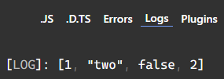

Tuple from TypeScript are not that much robust, they can misbehave & by time going, new versions of TS are making tuple more & more Robust. but here is an example.  
```typescript
let reg: [number, string, boolean];
let asfd = reg = [1, "two", false];
asfd.push(2)
console.log(asfd);
// the tuple range is broken here
```  
  