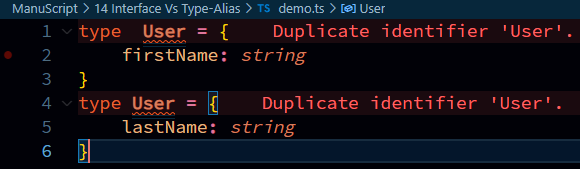

# Major Difference
## 1. Extending  
Extending Interface  
```typescript
interface User {
    firstName: string;
}

interface extUser extends User{
    lastName: string
}   // extending interface
```  

Extending Type-Alias  
```typescript
type User = {
    firstName: string;
}

type extUser = User & {
    lastName: string
}   // extending type
```  

## 2. Merging with same name  
in **interface** if you Merge (another way to extend) interface with same way, you can do it.
```typescript
interface User{
    firstName: string
}
interface User{
    lastName: string
}

const uOne : User =  {
    firstName: "Ganesh",
    lastName: "Chougale"
}

console.log(`${uOne.firstName} ${uOne.lastName}`);
```  

But you cannot do this with Type-Alias.  
```typescript
type  User = {
    firstName: string
}
type User = {
    lastName: string
}
```  
  

## 3. use cases  
1. Interface: Define objects with greater modification
2. Type-Alias: bind multiple types to create object or unions  

Official Documentation : https://www.typescriptlang.org/docs/handbook/2/everyday-types.html#differences-between-type-aliases-and-interfaces  