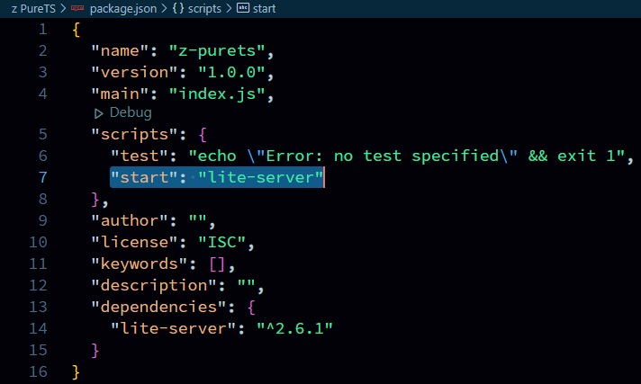
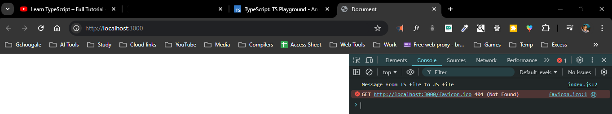

now we all set, how we gonna run main `index.html` file.  
there are two way to do that.  
1. using extenstion.
Live Server
2. using `package.json`
inside `package.json` we have `script` object we can inject run command there
A. in Main Directory terminal.  
```bash
npm i lite-server
```  
B. after that add  
```bash
    "start": "lite-server"
```  
inside `script` object.  
  
C. again in Main Directory terminal. 
```bash
npm start
```    
  
