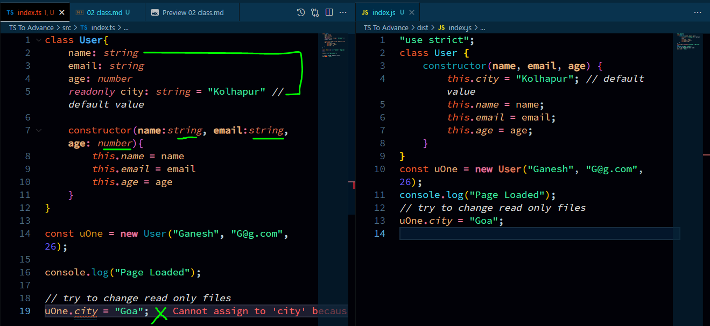
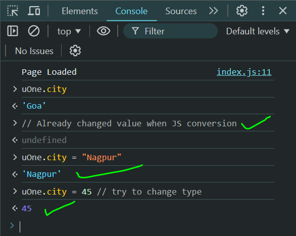

from `TS` file:
```bash
./src/index.ts
```  
```typescript
class User{
    name: string
    email: string
    age: number

    constructor(name:string, email:string, age: number){
        this.name = name
        this.email = email
        this.age = age
    }
}

const uOne = new User("Ganesh", "G@g.com", 26);
```  
  
we saw we cannot overwrite value.  
> lets try to override value from browser.  
  
we now witnessed a odd behavior here,  
1. Ts refused to change city but in browser we can see the city is changes from `kolhapur` to `Goa`.  
2. we can change value from console from `string` to `number`.

# why?
1. all the Ts code converted to vanilla JS, which means JS do not support readonly, untimately changing the city.
2. it displayed in console from plane JS so it appeared changed city as expected.  
3. we can change anything from browser's console but those changes are volatile & do not affect source file, so no worry about that.  