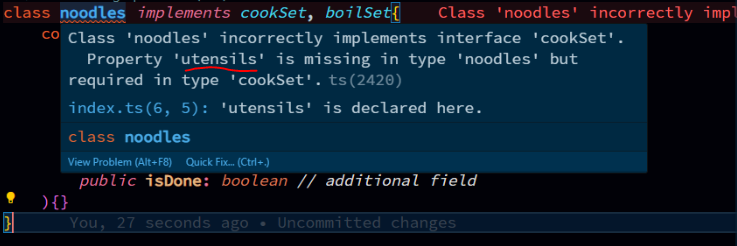

The strictness of Interface is we can use **more** of it, but strictly cannot use **less** of it.  
what does that mean?  
> 1. when we create a interface & inherits that interface into another sub interface can add additional fields to that.  
> 2. but we cannot skip the byDefault field from OG interface, not even a single field. 
### here we have 3 main interfaces 
```typescript
interface cookSet{
    stoveAvail: boolean;
    shallowPanAvail: boolean;
    deepPanAvail: boolean;
    steamerAvail: boolean;
    utensils: boolean;
}

interface frySet{
    oilAvail: boolean;
}
interface boilSet{
    waterAvail: boolean;
}
```  
### Added value
```typescript
interface cookSet{
    stoveAvail: boolean;
    shallowPanAvail: boolean;
    deepPanAvail: boolean;
    steamerAvail: boolean;
    utensils: boolean;
}

interface frySet{
    oilAvail: boolean;
}
interface boilSet{
    waterAvail: boolean;
}

class noodles implements cookSet, boilSet{
    constructor(
        public stoveAvail: boolean,
        public shallowPanAvail: boolean,
        public deepPanAvail: boolean,
        public steamerAvail: boolean,
        public utensils: boolean,
        public waterAvail: boolean, // from boilSet
        public isDone: boolean // additional field
    ){}
}
```  

### Skipping existing value (not allowed)  
```typescript
interface cookSet{
    stoveAvail: boolean;
    shallowPanAvail: boolean;
    deepPanAvail: boolean;
    steamerAvail: boolean;
    utensils: boolean;
}

interface frySet{
    oilAvail: boolean;
}
interface boilSet{
    waterAvail: boolean;
}

class noodles implements cookSet, boilSet{
    constructor(
        public stoveAvail: boolean,
        public shallowPanAvail: boolean,
        public deepPanAvail: boolean,
        public steamerAvail: boolean,
        // removed utensils from here
        public waterAvail: boolean, // from boilSet
        public isDone: boolean // additional field
    ){}
}
```  
this will throw us error.  
  