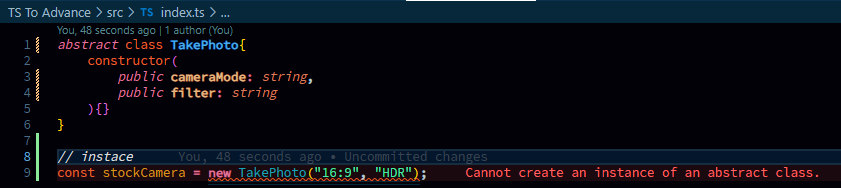
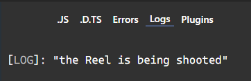

```typescript
class TakePhoto{
    constructor(
        public cameraMode: string,
        public filter: string
    ){}
}

const stockCamera = new TakePhoto("16:9", "HDR"); // instace

// interface use `implements` keyword abstract class use `extends` keyword

class Instagram extends TakePhoto{
    constructor(
        public cameraMode: string,
        public filter: string,
        public burst: number
    ){
        super(cameraMode, filter);
    }

}

const instaCam = new Instagram("userDefined", "userDefined", 3); // instace
```  
here we can see we can extend the sub class with super, & make instances of both class.  

> but in abstract class, we cannot create instance of superclass, it only means to inherited by other classes. 
as soon as we make the super class abstract its instanc will throw us error.  
```typescript
abstract class TakePhoto{
    constructor(
        public cameraMode: string,
        public filter: string
    ){}
}

// instace
const stockCamera = new TakePhoto("16:9", "HDR"); 
```  
### preview:  
  


```typescript
abstract class TakePhoto{
    constructor(
        public cameraMode: string,
        public filter: string
    ){}

    abstract shootReel() : void
}

// abstract class doesn't meant to built own instances

class Instagram extends TakePhoto{
    constructor(
        public cameraMode: string,
        public filter: string,
        public burst: number 
    ){
        super(cameraMode, filter)
    }

    shootReel(): void {
        console.log("the Reel is being shooted");
    }
}

const userIG = new Instagram("Default", "HDR", 3);
userIG.shootReel();
```  
### preview:  
  