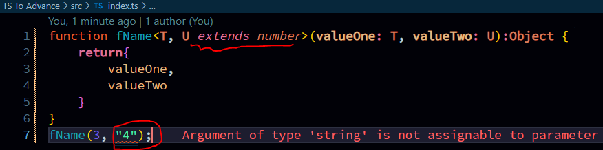

## locking types by using `generics`  
```typescript
function fName<T, U>(valueOne: T, valueTwo: U):Object {
    return{
        valueOne,
        valueTwo
    }
}
fName(3, "4");
```  

```typescript
function fName<T, U extends number>(valueOne: T, valueTwo: U):Object {
//     return{
//         valueOne,
//         valueTwo
//     }
// }
fName(3, "4");
```  
### Preview:  
  

## using interface as gerenics  
```typescript
interface Credentials{
    username: string
    password: string
}

function fName<T, U extends Credentials>(valueOne: T, valueTwo: U):Object {
    return{
        valueOne,
        valueTwo
    }
}
fName(3, {username: "ganesh", password: "Ganesh@123"});
```  

## generic class  
```typescript
class dashBoard<T>{
    public cart: T[] = []
    
    addToCart(product: T){
        this.cart.push(product);
    }
}
```  