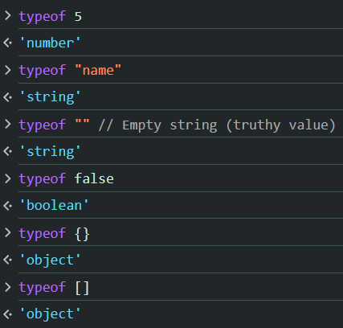
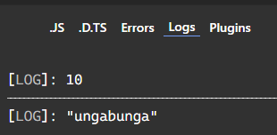
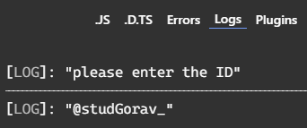
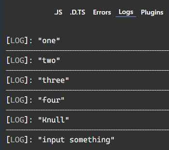

The art of narrowing in programming means how you can shrink your pinpoint focus on your valiable or state.  

the one who masters it rules on programming skill.  

for example in realm of javascript we can narrow down a variable via condition statement by using its `typeOf` operator.  
### Preview:  
  
these are commonly used scenarios.  

```typescript
function detect(val: number | string){
    if(typeof val === "string"){
        return val.toLowerCase();
    }else {
        return val + 7;
    }
}
console.log(detect(3));             // output: 10
console.log(detect("uNgaBunGa"));   // output: ungabunga
```  
here in using if statement we narrow downed the `val` variable.
### Preview:  
   
```typescript
function provideID(val: string | null){
    if(!val){
        return ("please enter the ID");
    }else{
        return `@${val}_`
    }
}
console.log(provideID(null));
console.log(provideID("Gorav"));
```  
### Preview:  
  
```typescript
function printAll(strs: string | string[] | null) {
  if (strs) {
    if (typeof strs === "object") {
      // typeOf array is ojbect
      for (const s of strs) {
        console.log(s);
      }
    } else if (typeof strs === "string") {
      console.log(strs);
    }
  } else {
    console.log("input something");
  }
}
printAll(["one", "two", "three", "four"]);
printAll("Knull");
printAll(null);
```  
### Preview:  
  