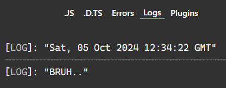

we seen `typeof` & `in` now lets see the instanceof for narrowing the variable further down.
```typescript
const myArr = new Array(); // instace of an array
const myDate = new Date(); // instace of an date
const myObj = new Object(); // instace of an object
```  
we know that every entity from above or another entities like that, are instance of that perticular object.  
so we can narrow down our variable more with using `instaceof` operator & its almost identical to `typeof` operator.  

```typescript
const myDate = new Date(); // instace of an date

function logval(val: Date | string) {
	if(val instanceof Date){
		console.log(val.toUTCString());
	}else{
		console.log(val.toUpperCase());
	}
}

logval(myDate);
logval("bruh..")
```  
### Preview:  
  
```typescript
class Dog {
    bark() {
        return "Woof!";
    }
}

class Cat {
    meow() {
        return "Meow!";
    }
}

function animalSound(animal: Dog | Cat) {
    if (animal instanceof Dog) {
        return animal.bark(); // animal is narrowed to Dog
    } else if (animal instanceof Cat) {
        return animal.meow(); // animal is narrowed to Cat
    }
}

const myDog = new Dog();
const myCat = new Cat();

console.log(animalSound(myDog)); // Output: Woof!
console.log(animalSound(myCat)); // Output: Meow!

```  

now lets go for some tricky part.  
```typescript
type Fish = { swim: () => void };
type Bird = { fly: () => void };

function isFish(pet: Fish | Bird): pet is Fish {
    return (pet as Fish).swim !== undefined;
}

function getHome(pet: Fish | Bird) {
    if (isFish(pet)) {
        return "Glass Tank";
    } else {
        return "Wire Cage";
    }
}

// Example instances of Fish and Bird
const myFish: Fish = { swim: () => console.log("Fish is swimming!") };
const myBird: Bird = { fly: () => console.log("Bird is flying!") };

console.log(getHome(myFish)); // Output: Glass Tank
console.log(getHome(myBird)); // Output: Wire Cage
```  