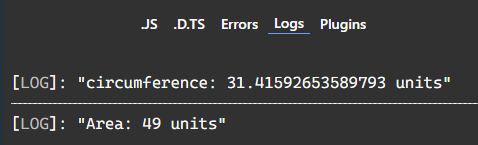

```typescript
interface Circle{
	kind: "circle"
	radius: number
}
interface Square{
	kind: "square"
	side: number
}
interface Rectangle{
	kind: "rectangle"
	length: number
	width: number
}

type shape = Circle | Square | Rectangle;

// using if statement
function getShapeIF(para: shape){
	if(para.kind === "circle"){
		const circumference = (2*para.radius) * Math.PI;
		return `circumference: ${circumference} units`
	}else if(para.kind === "square"){
		const result = (para.side) * (para.side);
		return `Area: ${result} units`
	}else if(para.kind === "rectangle"){
		const result = (para.length) * (para.width);
		return `Area: ${result} units`
	}else{
		return
	}
}

const myCircle: Circle = {kind:"circle", radius:5}
console.log(getShapeIF(myCircle));

// using switches
function getShapeSwitch(para: shape){
	switch(para.kind){
		case "circle":
			let circumference = (2*para.radius) * Math.PI;
			return `circumference: ${circumference} units`;
		case "square":
			const sArea = (para.side) * (para.side);
			return `Area: ${sArea} units`
		case "rectangle":
			const rArea = (para.length) * (para.width);
			return `Area: ${rArea} units`
		default:
			const _defaultCase: never = para
			return _defaultCase;
	}
}

const mySquare: Square = {kind:"square", side:7};
console.log(getShapeSwitch(mySquare));
```  
### Preview:  
  
giving hardcoded literal values to a property in an interface is a key part of implementing discriminated unions in TypeScript.